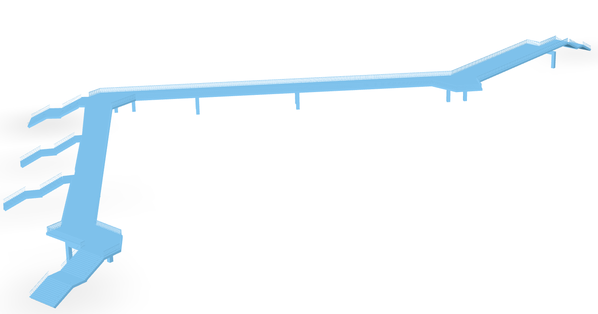

 

  

  <h3 align="center">Blaues Wunder</h3>

  
Table of Contents

  <ol>
    <li><a href="#about-the-project">About The Project</a></li>
    <li><a href="#license">License</a></li>
    <li><a href="#contact">Contact</a></li>
  </ol>

## About The Project

(<a href="#readme-top">back to top</a>)

## License

Distributed under the MIT License. See `LICENSE` for more information.

(<a href="#readme-top">back to top</a>)

## Contact

(<a href="#readme-top">back to top</a>)

